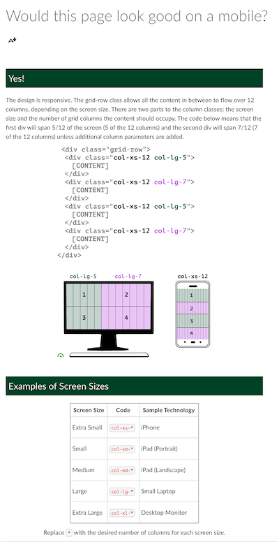
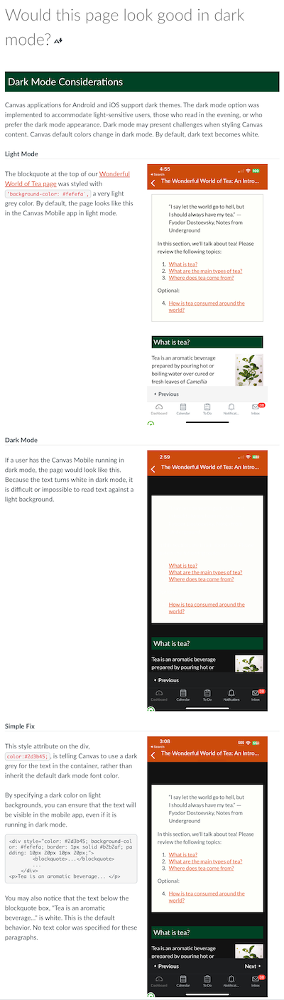

## Non-Course Projects

### Faculty Communications Manual

I have set up a GitHub repository to work on the faculty communications documents I have been creating for the course development manual. I would like to keep them private for now, but share it with you. To do this, I hope to add you as a collaborator. If you don't yet have one would you be willing to [Sign up for a GitHub account](https://docs.github.com/en/get-started/signing-up-for-github/signing-up-for-a-new-github-account)? That way I could share links and you could suggest edits. New or updated this week:

- [Lecture Recording Guidance](https://github.com/mundorfd/faculty-comms/blob/main/Lecture%20Recording%20Guidance.md)
- [Why Add an Assignment Purpose](https://github.com/mundorfd/faculty-comms/blob/main/Why%20Add%20an%20Assignment%20Purpose.md)
- [Late DOC Assignment Email](https://github.com/mundorfd/faculty-comms/blob/main/Late%20DOC%20Assignment%20Email.md)
- [MLOs and Blooms Taxonomy Levels](https://github.com/mundorfd/faculty-comms/blob/main/MLOs%20and%20Blooms%20Taxonomy%20Levels.md)
- [Alt Text](https://github.com/mundorfd/faculty-comms/blob/main/Alt%20Text.md)
- [Gradescope](https://github.com/mundorfd/faculty-comms/blob/main/Gradescope.md)
- [Embedding Slides and PDFs into Canvas](https://github.com/mundorfd/faculty-comms/blob/main/Embedding%20Slides%20and%20PDFs%20into%20Canvas.md)
- [Media Strategy Confirmation](https://github.com/mundorfd/faculty-comms/blob/main/Media%20Strategy%20Confirmation.md)
- [Using Images in Courses](https://github.com/mundorfd/faculty-comms/blob/main/Using%20Images%20in%20Courses.md)
- [Permalinks Persistent Links](https://github.com/mundorfd/faculty-comms/blob/main/Permalinks%20Persistent%20Links.md)

### IDKB

-Updates to [Slack – IDKB 🦫](https://idkb.oregonstate.education/knowledge-base/slack/)

### Internship Program

### OLC Conference

Designed the following pages for our HTML course, doing an FAQ section. On the first page, I designed the visual in Illustrator.

### Onboarding New IDs

- Attended two ID Candidate Presentations. Submitted feedback through Google Form for both.
- Created a new [ID Employee Onboarding Asana Template](https://app.asana.com/0/1205400571207180/1205400566625516) requested review with Laurie and Cyndie
- Created [ID Employee Skills Self-Assessment](https://oregonstate.qualtrics.com/jfe/form/SV_2c7cZraesw0bkX4)

### Sr. ID Responsibilities

- Two rounds of extensive feedback on Raul's blog post

### Other

- Fielded support request from OC 434/534 from Byron Crump

## Course Development Projects

### F23

#### CEM 471

- I have embedded media through week 5. Week 6 and beyond was. not ready yet from Sarah.
- Working with students to get Canvas assignments and quizzes built, after I cleaned up each one.

##### before

##### after

### W24

#### AEC 250

- We are building reading quizzes by selecting questions from an OpenStax course. For each week, several questions are chosen to put in three question banks. The quizzes randomly draw three questions each week. (Looking at 30 or so question banks.) I have built one as a proof of concept and finalized with the Graduate student building the quizzes, how we will identify which questions go in which bank. See the [Planning Worksheet](https://oregonstate.box.com/s/rek5izjl8j88q5dwqxftw8geb5gac3bj).
- I am using a [Canvas Quiz Settings Survey](https://oregonstate.qualtrics.com/jfe/form/SV_6t9Z0zHpNuEKfNs) I built in Qualtrics to get the settings correct for all quizzes and assignments in the course. Been a good tool for me in a couple of courses, including this one. Uses skip logic, to for example, ask additional questions about timing, etc when they want students to view correct answers.

#### CCE 207

- Joe has made good progress on video recordings (Lightboard and Fieldtrip videos filmed with Drew.) He has outlined the course and will be delivering modules soon.

#### CH 332

- got access to the existing course site, from which he plans to pull content
- Worked on LaTex for Chemical Figures
  
- Began Course Design
  From this:

to this

### No activity this week

- CEM 372
- NSE 515
- CS 162H (mostly done)
- SCLM 450/550

#LKAD