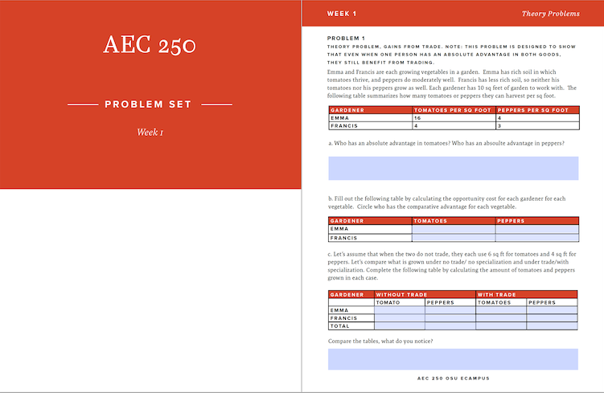
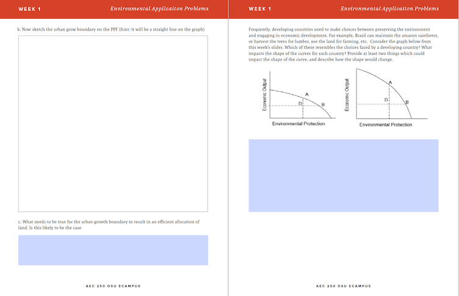
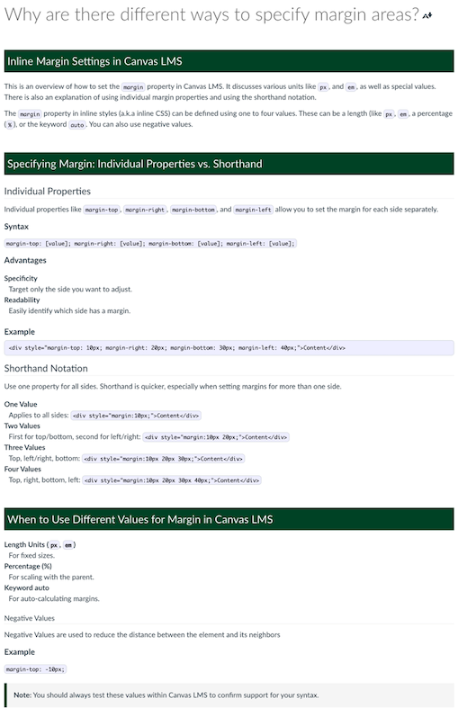

# 2023-10-06 Status Update

## Schedule Notes

* I was out on a pre-approved vacation day Friday

## Course Development Projects

### W24

#### AEC 250

* Penny wants to use Gradescope for weekly problem set this we need a fillable form for students. I created one as a POC for them.

|                    |                    |
|--------------------|--------------------|
|||

#### CCE 207

* Reviewed development schedule and progress with Joe. Joe has completed all his planned recordings except for one the video team will be shooting with him in January. It is the third in a series of videos on an on-campus construction project. See [CCE 207 - W24 - Video - Asana](https://app.asana.com/0/1204760092812445/1204760172868576)
* Based on the fact that he has most of his recording done, but none of his content delivered, I have put the content at 30%. I hope to get to the build soon, but need content first. We discussed some "templates" I could create for Overview Pages and weekly reflection assignments. I also thought I could help with a rubric for the reflection assignments.

#### CH 332

* After meeting with Jeff, I worked on quizzes for CH 322. Big migration project moving several hundred questions from quizzes into question banks with a specific naming convention. After suggesting a naming convention, documenting his instructions, and getting the criteria of which quizzes to use, I created a Student Asana Task to help with this project: [CH 332 - W24: Convert Quiz Questions to Question Banks - Asana](https://app.asana.com/0/1204909280946840/1205683250189952)

#### CS

* Built An Assignment Nauman Had Delivered
* Followed Up With Lecture Team. He Hadn't Heard Back On Video Quality Sample

#### CEM 372

### S24

* Setup template for S24 projects and sent intake request emails to all S24 courses. Updates are documented in the [CEM 372 milestones checklist](https://oregonstate.box.com/s/pj8osq51gil24s1obnr1k9v2fp3mqkrc)

#### CS 201

* Intake scheduled for Wednesday, October 11, 2023

#### CH 123

* Intake scheduled for Wednesday, October 11, 2023

#### SOC 280

* Requested intake meeting, not yet scheduled

#### CS 499 (CS 435)

* Intake scheduled for Wednesday, October 18, 2023

#### NSE 515

* Built Module 7
* Created course banners
* Documented and submitted request for extension to S24 development

## Non-Course Projects

### IDKB

* Wrote [How to Get the Link for a Specific Course Calendar in Canvas LMS – IDKB 🦫](https://idkb.oregonstate.education/knowledge-base/specific-course-calendar-link/)

### Internship Program

* Scheduled and prepped for Intern Orientation Meetings
* Reached out to Intern mentors, to follow up on their initial meetings, and any thoughts they had about the type of support the interns would need
* Completed, signed, and submitted AHE Learning Agreements for Skye and Julie. [Stevie Wonder - Signed, Sealed, Delivered](https://youtu.be/WvRwR-hZDVY?si=2sCXc61ouPQkUoZ9)
* Spoke with AHE about extra opportunities for interns. Kate wanted to invite Skye to a media shoot, I like to invite them to things like Research Community and Media Showcase. These are optional activities, and particularly with Skye, limited to 3 hours a week, didn't want to offer if those would be counted against that time. Becky said Skye could log the extra hours and bank them toward a future internship credit. Shared with both Skye and Julie. I have added this note to my ID Orientation agenda for the future.

### OLC Conference

* Wrote bio and added image to OLC profile
* Rehearsed and delivered with Phil and Dana our workshop
* OLC Accelerate. Created an additional page explaining the intricacies of margins for our course site:

	

### Onboarding New IDs

* Onboarding: Prep [F23 ID Team Orientation Meetings - Google Sheets](https://docs.google.com/spreadsheets/d/1dvfB6SL6810lc7gO-ft8gAULGBqcbpYgCRAexyBTYZ4/edit#gid=0) spreadsheet for orientation meetings. Shared at ID Meeting
* Confirmed first date of hire

### Other

* Attended Media Showcase

#LKAD
