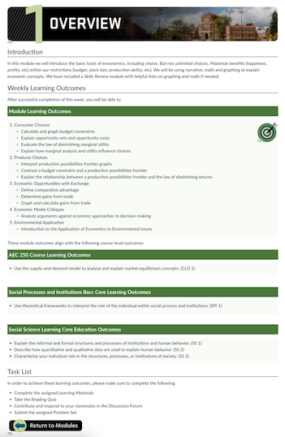
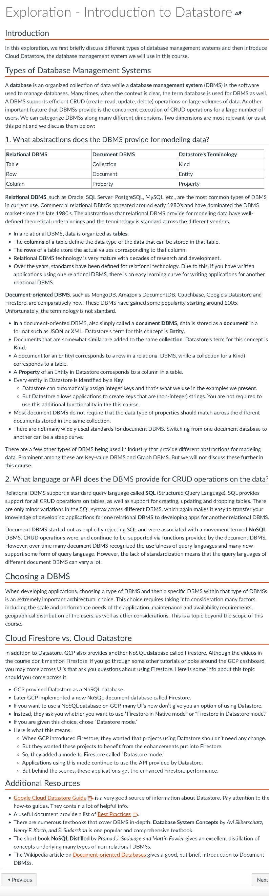
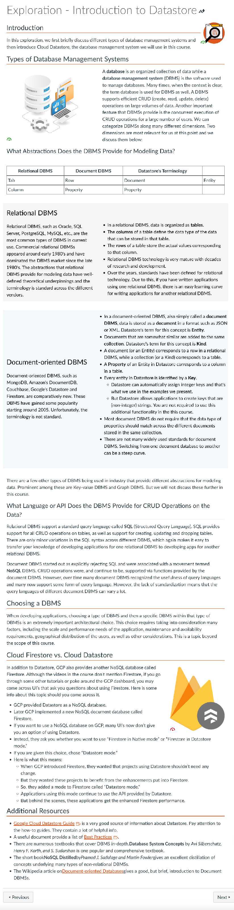

# 2023-10-20 Status Update

## Course Development Projects

### W24

#### AEC 250

* Developed Proof of Concept for Gradescope Homework submission
	* Setup a studio site with Gradescope integration
	* Created a fillable form from homework - using InDesign and Acrobat
	* Built the Gradescope assignment (uploaded form, identified questions for outline, etc)
	* Schedule two demos with AT for Gradescope, one with me for configuration, one with instructors.
	* Sent instructions on accessing the Gradescope Sandbox course I had set up and creating a social login so they could see the student experience on their assignment.
* Setup development site and made requested customizations
* Designed the overview pages, which are designed to migrate from Bacc Core → Core Ed. there are three sections of CLOs, course, Bacc Core and Core Ed. We will put all three in the studio site. Then, until Core Ed are in effect, they will delete that section after migrating from studio site. When the new ones are implemented, they will import the studio again and delete the bacc core. She wanted a record of all them.

#### CCE 207

* Check in Meeting with Joe, he's delivered two modules. I haven't started building yet. He's aware of upcoming materials deadline and not concerned. (He's been good about this in our past two developments.)
* Discussed how to handle students being asked to attend a virtual career fair (synchronous). My advice:
	* give as much notice as possible
	* backup plan for students if they can't attend
	* take the hours it will take into account given the workload

#### CH 332

- No activity this week

#### CS 493

* Shared information from media team on recording quality
* Nauman has delivered four modules
* I built Module 3. He is re-using some pages that were put together outside of an Ecampus Development. I have been working on improving the quality of those, by chunking information and adding some visual elements.

|before                    |after                    |
|--------------------|--------------------|
| |  |

#### CEM 372

- No activity this week

#### ME 383

* Reconnected with Matt, since his delivery term is approaching. Shared information on bookstore form and suggested we meet to support the transfer. I also have several textbooks to return to him, which were used to identify where his slide images are coming from. That information has been compiled and returned to him.

### S24

#### BDS 599

* Prepared for and held intake meeting
* Submitted DIY Lecture recording request and one for an H5P site.
* Graded DOC assignment Week 1 Course Planning Chart

#### CS 201

- No activity this week

#### CH 123

- No activity this week

#### SOC 280

##### Intake Preparation

* Put together [Development timeline](https://oregonstate.box.com/s/er63y019udruf6x9ckeed5bf6jxaslof)
* Review of course development and CPM records (which were present!)
* Compiled [a list of active learning and media ideas](https://oregonstate.box.com/s/xiu7d09e4j96b423abxigdx3yf3xsppm) for the course.
* Documented media request for an oral history project and submitted additional requests for interviews, course intro, and lectures.

#### CS 499 (CS 435)

* Reviewed Course Planning Chart submitted as a written out document. The proposed outcomes were problematic with too many verbs, and a high quantity. I created a suggested update consolidating the verbs under a parent verb. Rewrote her CLOs which she is going to use. Here was the suggestion as written:

	> one suggestion would be to reduce the use of verbs for each outcome for measurability, knowing that it would encompass a range of skills and tasks, and achieving proficiency in that outcome will require multiple steps. For example, when the outcome states "Define," students are expected to not only define terms but also understand their implications and discuss them in context. Similarly, an outcome like "Implement" will require students first to identify the appropriate methods and then execute them effectively.

* Shared information on videos/Ecampus Intellectual Property. She wants to house her videos on YouTube in addition to sharing with Ecampus

#### NSE 515

## Non-Course Projects

* Facilitator for Intro to AI for Ecampus Faculty

### Faculty Communications Manual

New or updated this week:

### IDKB

### Internship Program

#### Skye

* Worked with Skye on her H5P development. She actually showed me how you can customize the colors of the H5P activities.
* She identified ~15 images she wanted from Adobe stock, which I licensed and downloaded into a shared drive.

#### Julie

##### ID Design Library Project

Met with Julie. She is working with Chris on conducting a pre-review of the ID Design Library. What she worked on last week:

* Started to inventory library. Jotting down notes module by module, things that she doesn't understand, that they do.
* Identify topics for cross reference, is there a natural order to the next thing, jump back to the table of contents.
* Wants to use analytics who is using it, how are they are using it.

#### HTML Tutorials

* Our status updates take about 15 minutes. With the remainder of the hours I started her on the HTML lessons. She's quite excited about those.

### OLC Conference

- Travel to conference Tuesday, October 24, 2023​. Will be traveling and attending the remainder of the week.

### Onboarding New IDs

* Walked through scheduling needs and asana project with Laura. Assigned IDs to meetings and updated timeframe files.

#LKAD 
