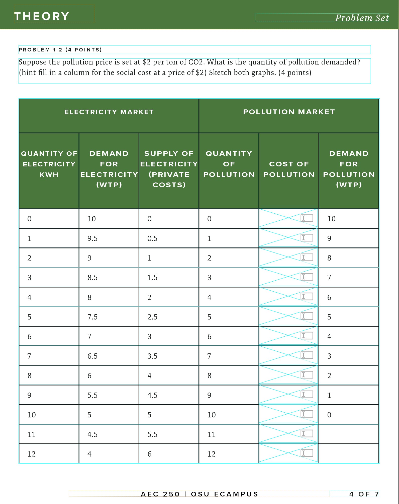

# 2024-02-05 Status Update

## Course Development Projects

### W24

#### AEC 250

To complete the project, Penny has to:
* finish updating her slides (alt text, removing annotations for her PDF copies to embed)
* review and update the interactive homework files
* build a discussion rubric
* course syllabus, communication policy, etc
On my list (I haven't had the content to do these steps until last week):
* update the learning materials pages with the readings she has provided
* embed the media and the slide decks
* setup the Gradescope LTI and assignments with the homework (we will do this in the live banner site, as per Academic Technologies recommendation, so will wait until that is available shortly before Summer Term)
Jana got the recordings and said they were done by Monday, February 05, 2024.

**updates**

* Built Student-Facing instructions on using Gradescope both by filling out the interactive PDF digitally or printing and scanning: [Start Here - Homework Submission with Gradescope: AEC_250_DEV](https://canvas.oregonstate.edu/courses/1953586/pages/start-here-homework-submission-with-gradescope?module_item_id=24093472)
* I finished all but two of the remaining interactive PDFs for the AEC 250 homework. They didn’t complete giving me the information for those assignments until the middle of last week.I am including a screenshot so you can understand what those are like. Each is 7–10 pages.

#### CH 332

* CH 332: Review of Unit Assessment Study Guides with Kate
* I finished my build activities last week. We have a wrap-up meeting on Tuesday, February 6.

#### CS 493

* Naumon asked for Mud Card surveys, added 10 weekly Mud Card Surveys built with Qualtrics to the course
* Finished Ecampus Essentials, updated overview links, marked 100% in Salesforce. Launching in Sprin

#### MME 383

* Matt is feeling disconnected from his students in his first Ecampus delivery. He asked for suggestions. I wrote up a quick proposal to add weekly or biweekly mud card surveys. Haven't heard back

### S24

#### BDS 599

* No activity this week
* Meeting scheduled for Tuesday, February 6

#### CS 201

* He's been quiet, but I see activity in our box folder! Will check in this week.

#### SOC 280

* Meeting with media team on Geocaching custom app. The meeting primarily focused on including fields for title, date, description, and media (images or videos) in the geocache activity recording form. There was also a discussion on the layout and functionality of the map interface, and the ability to export data for grading.
* Since the media team doesn't really develop apps, but rather puts the activity on a mobile-friendly web page, Nik B asked that we include instructions for students on _Saving a Web Page as a Bookmark "App" on Your Smartphone_. I have written this up and sent to him and Mateo. They can use it for other projects too.

#### CS 499 (CS 435)

##### Ami's Progress

* The course is approved (now called CS 332). I believe delivery is bumped to Summer?
* Sent a draft version; changes are expected.
* Progress on Module 1 in Canvas; this module is nearing completion.

##### My Activities

The following seemed to have triggered an extension request.

1. Reminded of Spring term completion target and standard pre-delivery course development.
2. Highlighted adherence to [Ecampus Essentials](https://ecampus.oregonstate.edu/faculty/standards-principles/ecampus-essentials/).
3. Utilizing [Milestones document](https://oregonstate.box.com/s/nyxnm8d13d6uinynl6rf0x08m6728u72) to track progress; noted current delay. Provided specific content deadlines.
4. I asked that she review the department's guidance on weekly hours per credit; in her draft syllabus, it was high.
5. Addressed accessibility issues and shared link creation guidance.

#### NSE 515

* Submitted media request for graded H5P activities

### U24

#### CH 123

* no activity this week

#### CS 290

* Setup studio site
* Confirmed media requests
* No content yet

#### MAST 201

* Met with Lori to review media needs, share project milestone dates, discuss assessment strategy, etc for this course. Last week, she filled out a [Virtual Intake Survey](https://oregonstate.qualtrics.com/jfe/form/SV_czNGysQKErYe8pU) since we were starting late due to scheduling issues (weather, her travel).
* Lori hasn't really started, she is working on a course outline and MLOs before our next meeting
* I have begun working a list of active learning opportunities. "_Humans and the Ocean_" lets students explore marine topics through multidisciplinary methods (literature, art, music), so we are looking to develop three student projects, one in each area. For instance, students might create an interactive marine-themed story, compose soundscapes using ocean sounds, or curate a digital art gallery inspired by the ocean. I'm excited about this!

#### MB 302

* Five faculty are teaching MB 302, four face-to-face, and Linda for the Ecampus section. Linda has found out that they all use different Course Learning Outcomes. Feb 1, she submitted a CIM with new CLOs that were agreed upon by all faculty teaching MB 302, any modality/campus:

#### NMC 3xx

* Created a custom media request for an online dating app: [NMC 3XX- U24 - Catfish or Perfect Match App](https://app.asana.com/0/1206330558994035/1206468256113095)
* Created a custom palette for this course:

	

## Non-Course Projects

### Feedback Taskforce

* I reviewed and provided feedback to Mary Ellen on our committee's Student Feedback Survey Toolkit 2.0. I also created a new document we could share with participating faculty that explains things to consider when selecting Qualtrics or a Canvas survey.

### Faculty Communications Manual

New or updated this week:

### H5P Admin

* Created three H5P sites from Media Requests assigned to me. Sent instructor and ID access information.

### IDKB

### Internship Program

* Progress check-in with Julie
* HTML lesson on using `
`

### QM Pre-Review

### Sr. ID Responsibilities

* Reviewed and gave Feedback on Tianhong's 2024 Conference on Engaged Learning Proposal <https://docs.google.com/document/d/1WkTK65VFkCUfm6DnwfRC48gNor1cTnMlXXoaJwnuWmk/edit?usp=sharing>
* ID2ID meeting shared survey results

### Other

* Submitted several nominations for Ecampus partner awards
* Attended Research Literacy Workshop
* ID Candidate Presentation and Survey Feedback

#LKAD 
