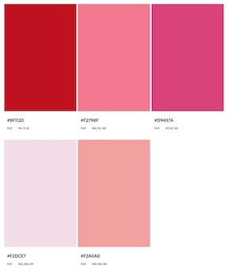

# 2024-02-05 Status Update

## Course Development Projects

### W24

#### AEC 250

#### CCE 207

#### CH 332

#### CS 493

#### CEM 372

### S24

#### BDS 599

#### CS 201

#### SOC 280

#### CS 499 (CS 435)

#### NSE 515

### U24

#### CH 123

#### CS 290

#### MAST 201

#### MB 302

#### NMC 3xx

* Created a custom media request for an online dating app: [NMC 3XX- U24 - Catfish or Perfect Match App](https://app.asana.com/0/1206330558994035/1206468256113095)
* Created a custom palette for this course:

	

## Non-Course Projects

### Faculty Communications Manual

New or updated this week:

### H5P Admin



### IDKB

### Internship Program

### Onboarding New IDs

### QM Pre-Review

### Sr. ID Responsibilities

### Other

%%add LKAD tag when ready to submit%%
